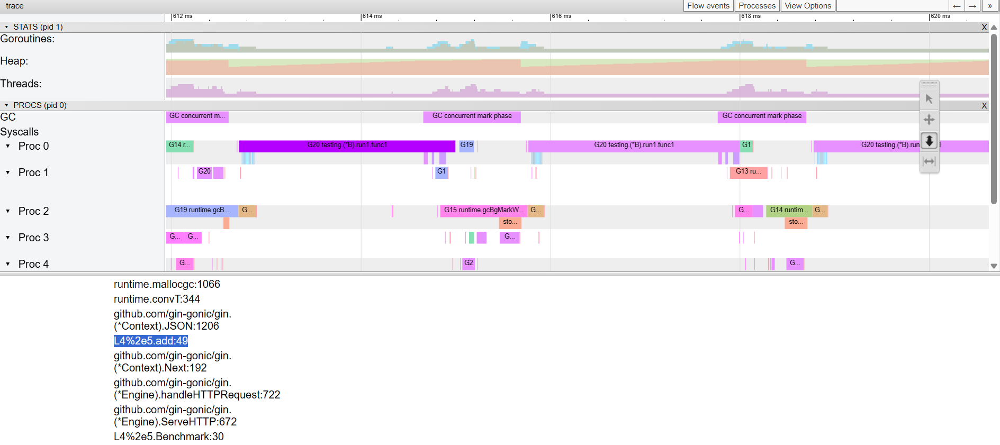
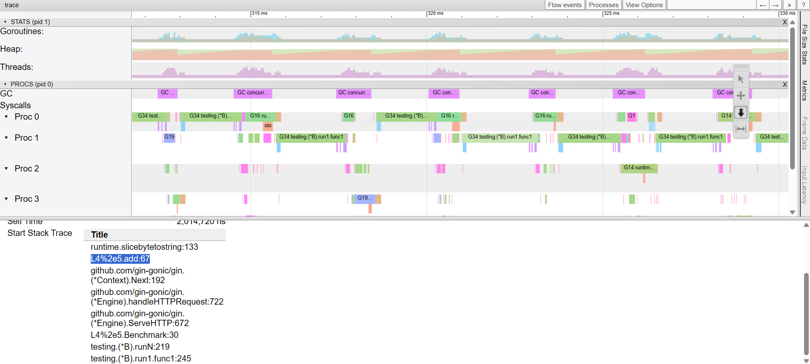

## L4.5


<h3 align="center">A Go project focused on performance optimization of a simple HTTP service using benchmarks, pprof, and execution tracing.</h3>

<br>

## API

A minimal HTTP endpoint for adding two integers, used as a baseline workload for performance profiling and optimization.


### POST /add

**Request:**

```json
{
  "first": 2,
  "second": 2
}
```

**Response:**

```json
{
  "result": 4
}
```

<br>

## Version History

###  add V1 
```go
func add(c *gin.Context) {

	var request request

	if err := c.ShouldBindJSON(&request); err != nil {
		c.JSON(http.StatusBadRequest, gin.H{"error": err.Error()})
		return
	}

	result := request.First + request.Second

	c.JSON(http.StatusOK, response{Result: result})

}
```

<br>

###  Benchmarks

```
goos: linux
goarch: amd64
pkg: L4.5
cpu: AMD Ryzen 3 7320U with Radeon Graphics         
Benchmark-8   	  144180	      8489 ns/op	    7503 B/op	      30 allocs/op
PASS
ok  	L4.5	1.241s
```


The benchmark results indicate ~30 allocations per request and ~7.5 KB of memory usage for a trivial arithmetic operation. This suggests that execution cost is dominated by HTTP and JSON processing overhead rather than computation. This already indicates that the cost of execution is not driven by computation, but by request/response processing overhead and JSON handling in the HTTP layer.

<br>

```
      flat  flat%   sum%        cum   cum%
     230ms 13.77% 13.77%      230ms 13.77%  runtime.futex
     100ms  5.99% 19.76%      210ms 12.57%  runtime.scanobject
      90ms  5.39% 25.15%       90ms  5.39%  runtime.memclrNoHeapPointers
      80ms  4.79% 29.94%       80ms  4.79%  runtime.tgkill
      50ms  2.99% 32.93%       50ms  2.99%  runtime.(*spanSet).reset
      40ms  2.40% 35.33%       60ms  3.59%  runtime.findObject
      40ms  2.40% 37.72%       60ms  3.59%  runtime.typePointers.next
      40ms  2.40% 40.12%       40ms  2.40%  runtime.typePointers.nextFast (inline)
      30ms  1.80% 41.92%       30ms  1.80%  gcWriteBarrier
      30ms  1.80% 43.71%       30ms  1.80%  internal/runtime/syscall.Syscall6
```

The CPU profile is dominated by Go runtime internals (GC, scheduler, memory scanning) rather than application logic. This confirms that the workload is not compute-bound, but instead heavily influenced by runtime overhead caused by frequent allocations and garbage collection activity.

<br>

```
      flat  flat%   sum%        cum   cum%
  633.91MB 56.07% 56.07%   633.91MB 56.07%  bufio.NewReaderSize
   88.04MB  7.79% 63.86%    88.04MB  7.79%  encoding/json.(*Decoder).refill
   60.02MB  5.31% 69.17%    60.02MB  5.31%  net/http.Header.Clone
   58.02MB  5.13% 74.30%    58.02MB  5.13%  net/textproto.MIMEHeader.Set
   51.52MB  4.56% 78.85%    51.52MB  4.56%  github.com/gin-gonic/gin/render.writeContentType
   49.01MB  4.34% 83.19%    49.01MB  4.34%  encoding/json.NewDecoder
   48.01MB  4.25% 87.44%    74.52MB  6.59%  net/http.readRequest
   43.01MB  3.80% 91.24%    43.01MB  3.80%  net/http.(*Request).WithContext
   25.50MB  2.26% 93.50%    25.50MB  2.26%  net/http/httptest.NewRecorder
   16.50MB  1.46% 94.96%    16.50MB  1.46%  net/url.parse
```

The memory profile highlights that most allocations originate from the HTTP and JSON processing pipeline (request parsing, headers handling, and decoder buffering), not from the business logic itself. In particular, a large portion of memory is consumed by request decoding and HTTP infrastructure overhead, indicating that the service is allocation-heavy due to framework and encoding layers rather than computation.

<br>



The displayed goroutine execution trace corresponds to a single benchmark iteration of testing.(*B).run1. The add handler is executed deep in the call stack, after testing, httptest, and Gin routing layers. A significant part of the trace is taken by mallocgc and string/JSON-related allocations triggered by request creation and response encoding. This confirms that execution is not CPU-bound in the handler itself, but driven by allocation-heavy HTTP and JSON infrastructure, with runtime work dominating the actual business logic.

<br>

###  add V2
```go
func add(c *gin.Context) {

	bufPtr := bufPool.Get().(*[]byte)
	buf := (*bufPtr)[:0]
	defer bufPool.Put(bufPtr)

	n, err := c.Request.Body.Read(buf[:cap(buf)])
	if err != nil && err != io.EOF {
		log.Printf("failed to read request body: %v", err)
		c.Status(http.StatusBadRequest)
		return
	}

	buf = buf[:n]

	var first, second int
	_, err = fmt.Sscanf(string(buf), `{"first":%d,"second":%d}`, &first, &second)
	if err != nil {
		log.Printf("failed to parse JSON from body %s: %v", string(buf), err)
		c.Status(http.StatusInternalServerError)
		return
	}

	c.Header("Content-Type", "application/json")
	_, err = c.Writer.Write([]byte(`{"result":` + strconv.Itoa(first+second) + `}`))
	if err != nil {
		log.Printf("failed to write response: %v", err)
	}

}
```

<br>

###  Benchmarks

```
goos: linux
goarch: amd64
pkg: L4.5
cpu: AMD Ryzen 3 7320U with Radeon Graphics         
Benchmark-8   	  176707	      6111 ns/op	    6674 B/op	      27 allocs/op
PASS
ok  	L4.5	1.094s
```

The V2 implementation reduces execution time (~28% improvement), but does not significantly reduce memory allocations. This indicates that most allocations are still dominated by the HTTP request lifecycle and runtime parsing logic rather than the application-level arithmetic. The main performance gain comes from removing encoding/json and replacing it with manual parsing and response construction.

<br>

```
      flat  flat%   sum%        cum   cum%
     300ms 16.67% 16.67%      300ms 16.67%  runtime.futex
     170ms  9.44% 26.11%      170ms  9.44%  runtime.memclrNoHeapPointers
      90ms  5.00% 31.11%      260ms 14.44%  runtime.scanobject
      50ms  2.78% 33.89%      130ms  7.22%  runtime.mallocgcSmallScanNoHeader
      50ms  2.78% 36.67%       50ms  2.78%  runtime.spanOf (inline)
      50ms  2.78% 39.44%       50ms  2.78%  runtime.typePointers.nextFast (inline)
      40ms  2.22% 41.67%      110ms  6.11%  fmt.(*ss).advance
      40ms  2.22% 43.89%      100ms  5.56%  runtime.scanblock
      40ms  2.22% 46.11%       60ms  3.33%  runtime.typePointers.next
      30ms  1.67% 47.78%       70ms  3.89%  fmt.(*ss).ReadRune
```

The CPU profile shows a shift in execution cost from JSON decoding to manual parsing using fmt.Sscanf. While overall runtime GC activity remains dominant, a significant portion of CPU time is now spent in fmt parsing routines, indicating that manual parsing introduced its own runtime overhead. Despite removing encoding/json, the workload remains runtime-bound rather than application-bound.

<br>

```
      flat  flat%   sum%        cum   cum%
    0.73GB 62.44% 62.44%     0.73GB 62.44%  bufio.NewReaderSize
    0.13GB 11.18% 73.63%     0.13GB 11.18%  net/textproto.MIMEHeader.Set (inline)
    0.08GB  6.93% 80.55%     0.08GB  6.93%  net/http.Header.Clone (inline)
    0.05GB  4.67% 85.23%     0.05GB  4.67%  net/http.(*Request).WithContext
    0.05GB  4.55% 89.78%     0.09GB  7.72%  net/http.readRequest
    0.03GB  2.21% 91.99%     0.03GB  2.21%  net/http/httptest.NewRecorder
    0.02GB  1.96% 93.95%     0.02GB  1.96%  net/url.parse
    0.01GB  1.13% 95.08%     0.17GB 14.86%  L4%2e5.add
    0.01GB  0.96% 96.04%     0.01GB  0.96%  bytes.(*Buffer).grow
    0.01GB  0.92% 96.95%     0.01GB  0.92%  bytes.NewReader
```

The memory profile shows that the majority of allocations are still concentrated in the HTTP stack, primarily in request buffering (bufio.NewReaderSize) and header processing. Although V2 reduces allocations in the application layer, these gains are marginal in comparison to the fixed overhead of net/http and httptest infrastructure.

<br>



The displayed goroutine execution trace corresponds to a single benchmark iteration of testing.(*B).run1. Compared to previous versions, the trace no longer shows heavy JSON serialization or runtime malloc-heavy operations inside gin.Context.JSON. Instead, the main cost has shifted to string conversion (slicebytetostring) inside the handler, indicating that most framework-level allocation overhead has been reduced. The execution path is still dominated by the HTTP testing and Gin routing layers, while the application logic remains lightweight and no longer triggers significant JSON-related allocations.

<br>

###  Results

```
old time/op    new time/op    delta
7.021µs        5.832µs       -16.93%

old alloc/op   new alloc/op   delta
7.327KiB       6.519KiB      -11.04%

old allocs/op  new allocs/op  delta
30.0           27.0          -10.00%
```

Benchstat comparison between V1 and V2 shows statistically significant improvements across all metrics. Execution time decreased by ~17%, memory usage by ~11%, and allocation count by ~10% (p < 0.001, n=10). This confirms that the optimization in V2 has a measurable impact on both CPU and memory efficiency. However, the remaining overhead is still dominated by HTTP request handling and runtime behavior rather than the arithmetic operation itself.